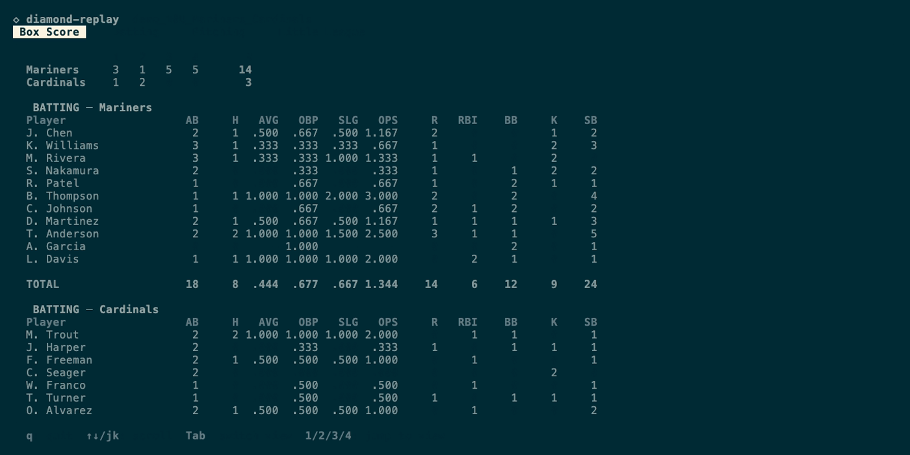

# diamond-replay

Replay engine for [GameChanger](https://gc.com) event streams. Parses the raw scoring data from GameChanger's play-by-play API and computes 40+ stats per player, plus youth-specific analytics. Built for youth baseball.

## CLI

```
diamond-replay game.json
diamond-replay game.json --json
diamond-replay game.json --json --little-league
diamond-replay game.json --json --no-steal-home
```



Four TUI views: Box Score, Batting, Pitching, Little League. Press `?` on any stat column for an interactive help card with formula, MLB benchmarks, youth context, and caveats. Enter to sort by selected column.

`--little-league` adds per-team youth stats: run sourcing, pace, baserunning chaos, free bases.

`--no-steal-home` replays the game with chaos scoring from 3B blocked. Runners stay at 3B but auto-score on any subsequent ball in play that doesn't end the inning, plus forced advances such as walks and HBP.

## Library

```rust
use diamond_replay::{replay_from_json, replay_from_json_with_options, ReplayOptions};

let result = replay_from_json(&event_json)?;
let simulated = replay_from_json_with_options(
    &event_json,
    ReplayOptions::no_steal_home(),
)?;

for (id, player) in &result.player_stats {
    let b = &player.batting;
    println!("{id}: {}/{} | {:.3} wOBA", b.hits, b.ab, b.woba.unwrap_or(0.0));
}
```

The supported library surface is exposed from the crate root: replay functions, `ReplayOptions`, `RuleSet`, `RawApiEvent`, `ReplayError`, `GameResult`, and the result stat structs.

## Stats

### Batting

PA, AB, H, TB, XBH, AVG, OBP, SLG, OPS, ISO, BABIP, wOBA, K%, BB%, BB/K, GB%, FB%, LD%, HR/FB, RBI, R, SB, CS, SB%, GIDP, CI, QAB%, Competitive AB%, P/PA, Hard Hit%.

### Pitching

IP, BF, Pitches, ERA, FIP, WHIP, K/9, BB/9, H/9, HR/9, K%, BB%, K-BB%, SwStr%, CSW%, FPS%, CStr%, Foul%, BABIP, HR/FB, GB%, FB%, LD%, Game Score, Pitches/IP.

### Little League (team-level)

| Category | Stats |
|----------|-------|
| Run sourcing | Runs on BIP, passive runs, BIP run % |
| Pace | Pitches per BIP, median pitches between BIP |
| Baserunning | Steals of home, WP, PB, CS |
| Free bases | BB + HBP + WP + PB + SB, per inning |
| Pitching | Pitches, ball%, strike%, K/inn, BB/inn, BIP/inn |
| Defense | Opponent SB, free bases allowed per inning |

### Game data

Linescores, transition gaps, dead time per inning, timestamps.

## Install

```toml
[dependencies]
diamond-replay = { git = "https://github.com/Jud/diamond-replay" }
```

## Input format

GameChanger game stream data: JSON arrays of scoring events from the GameChanger API. Each event has a `sequence_number`, an `event_data` JSON string containing the play details (pitches, BIP, base running, lineups), and optional `created_at` timestamps.

Events map 1:1 to scorer actions in the GameChanger app. They can be single plays or bundled transactions (e.g., a pitch + ball-in-play + base-running result in one atomic group). The engine handles undo/redo corrections, manual score overrides, dropped third strikes, catcher interference, and short lineups.

See `testdata/` for 14 complete game files from real 10U and 13U games.

## Test

```
cargo test
```

82 tests: 49 unit (stat computation, stat help coverage, rule compiler, simulation helpers), 33 integration/artifact tests (full-game linescores, accounting gates, LL balance invariants, undo/redo, simulation).

## Architecture

~6,200 lines of Rust, plus fixture-backed integration tests. Dependencies: `serde`, `serde_json`, `thiserror`, `ratatui`, `crossterm`.

```
src/
  lib.rs              public API and stable type re-exports
  event.rs            JSON parsing, typed event enums
  undo.rs             stack-based undo/redo resolution
  rules/              rule-set event stream compilers
  state.rs            GameState, BaseState, PAContext
  replay.rs           state machine, event loop, LL stats
  compute.rs          pure stat formulas
  score.rs            run recording, force-advance, overrides
  player.rs           lineup tracking, stat attribution
  stat_help.rs        interactive stat help data (30 entries)
  bin/diamond-replay  TUI + JSON CLI
```

## Not computable

Requires tracking hardware: exit velocity, launch angle, barrel%, sprint speed, bat speed, Stuff+, xBA/xSLG/xwOBA, spin rate, pitch movement, OAA, catcher framing.

See `docs/STATISTICS.md` for full stat reference.

## License

MIT
