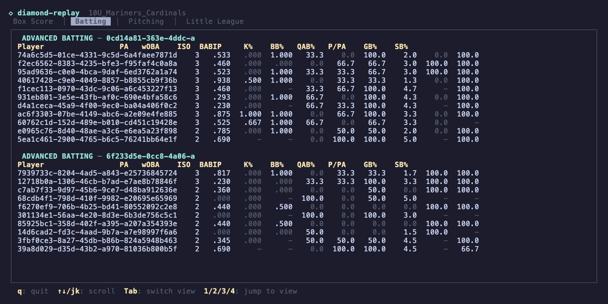
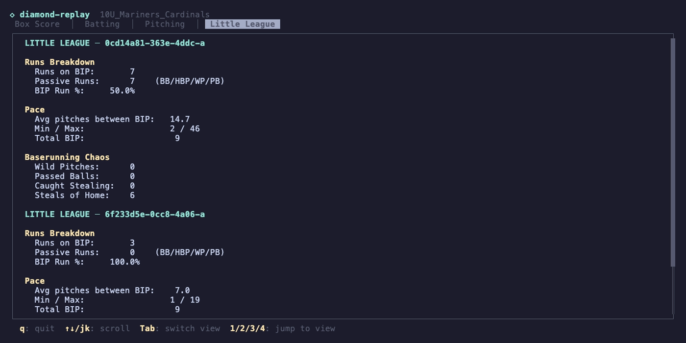

# diamond-replay

A baseball game replay engine that turns play-by-play event streams into real statistics. Feed it scoring data, get back AVG, OBP, SLG, wOBA, FIP, ERA, and 40+ other stats per player, plus youth-baseball-specific analytics like run sourcing, pace, and baserunning chaos.

Built for youth baseball. Tested against 12 real games across 10U and 13U divisions.

## CLI

Interactive TUI with four views: Box Score, Batting, Pitching, and Little League.

```
diamond-replay game.json
```





JSON output for programmatic use:

```
diamond-replay game.json --json
diamond-replay game.json --json --little-league
```

The `--little-league` flag adds a `teams` object with per-team batting, pitching, and defense stats shaped for youth baseball analytics (runs on BIP vs passive, pace between balls in play, baserunning chaos, free bases).

## Library

```rust
let result = diamond_replay::replay_from_json(&event_json)?;

// Linescores
println!("Away: {:?}", result.linescore_away); // [3, 0, 2, 0, 0]
println!("Home: {:?}", result.linescore_home); // [0, 0, 0, 7]

// Per-player batting
for (id, player) in &result.player_stats {
    let b = &player.batting;
    println!("{id}: {}/{} ({:.3}) | {} RBI | {:.3} OBP | {:.3} SLG | {:.3} wOBA",
        b.hits, b.ab,
        b.avg.unwrap_or(0.0),
        b.rbi,
        b.obp.unwrap_or(0.0),
        b.slg.unwrap_or(0.0),
        b.woba.unwrap_or(0.0),
    );
}

// Per-player pitching
for (id, player) in &result.player_stats {
    if let Some(p) = &player.pitching {
        println!("{id}: {} IP | {:.2} ERA | {:.2} FIP | {:.1}% K | {:.1}% CSW",
            p.ip_display.as_deref().unwrap_or("0.0"),
            p.era.unwrap_or(0.0),
            p.fip.unwrap_or(0.0),
            p.k_pct.unwrap_or(0.0) * 100.0,
            p.csw_pct.unwrap_or(0.0) * 100.0,
        );
    }
}
```

## What you get

### Batting (per-player and team-level)

| Stat | Description |
|------|-------------|
| PA, AB, H, TB, XBH | Plate appearances, at-bats, hits, total bases, extra-base hits |
| AVG, OBP, SLG, OPS | The traditional slash line |
| ISO, BABIP | Isolated power, batting average on balls in play |
| wOBA | Weighted on-base average (the gold standard offensive metric) |
| K%, BB%, BB/K | Strikeout rate, walk rate, walk-to-K ratio |
| GB%, FB%, LD% | Ground ball, fly ball, line drive rates |
| HR/FB | Home run to fly ball rate |
| RBI, R, SB, CS, SB% | Runs batted in, runs, stolen bases, caught stealing |
| GIDP | Grounded into double play |
| QAB, QAB% | Quality at-bats (the #1 youth baseball process metric) |
| Competitive AB% | Plate appearances reaching a 2-strike count |
| P/PA | Pitches per plate appearance |
| Hard Hit% | Hard ground balls + line drives / balls in play |

### Pitching (per-player and team-level)

| Stat | Description |
|------|-------------|
| IP, BF, Pitches | Innings pitched, batters faced, pitch count |
| ERA | Earned run average (with error-tagged runner tracking) |
| FIP | Fielding independent pitching |
| WHIP | Walks + hits per inning pitched |
| K/9, BB/9, H/9, HR/9 | Rate stats per 9 innings |
| K%, BB%, K-BB% | Strikeout rate, walk rate, and the difference |
| SwStr% | Swinging strike rate |
| CSW% | Called strikes + whiffs rate (best K predictor) |
| FPS% | First pitch strike rate |
| CStr%, Foul% | Called strike rate, foul ball rate |
| BABIP | Batting average on balls in play (against) |
| HR/FB, GB%, FB%, LD% | Batted ball profile |
| Game Score | Bill James game score for the start |
| Pitches/IP | Pitch efficiency |

### Little League (team-level, `--little-league`)

Stats designed for youth baseball where walks, wild pitches, and stolen bases dominate the game.

| Category | Stats |
|----------|-------|
| Run sourcing | Runs on BIP, passive runs (BB/HBP/WP/PB), BIP run % |
| Pace | Pitches per BIP, median pitches between BIP |
| Baserunning chaos | Steals of home, wild pitches, passed balls, caught stealing |
| Free bases | BB + HBP + WP + PB + SB, per inning |
| Pitching (own team) | Pitches, ball%, strike%, K/inn, BB/inn, BIP/inn |
| Defense | Opponent SB, free bases allowed per inning |

Example output from a real 10U game:
```json
{
  "runs_total": 14,
  "runs_on_bip": 7,
  "runs_passive": 7,
  "runs_on_bip_pct": 50.0,
  "K_pct": 29.0,
  "BB_pct": 38.7,
  "BIP_pct": 29.0,
  "steals_of_home": 6,
  "free_bases": 37,
  "median_pitches_between_bip": 6.0,
  "pitches_per_BIP": 14.7
}
```

Half the runs came from balls in play. The other half came from walks, wild pitches, and passed balls. 6 steals of home. 37 free bases in 4 innings. That's 10U baseball.

### Game data

| Field | Description |
|-------|-------------|
| Linescores | Runs per inning, home and away |
| Transition gaps | Dead time between half-innings (seconds) |
| Dead time per inning | Total non-play time per full inning |
| Timestamps | First and last event timestamps |

## How it works

The engine replays every pitch, every batted ball, every stolen base, reconstructing the full game state from a sequence of scoring events. It applies the rules of baseball: runners advance on hits, force on walks, tag on fly outs. Explicit base-running events from the scorer override the defaults when something unusual happens.

Every run is attributed to a specific player. Every out is tracked against the pitcher on the mound. The engine handles the mess that real scorers create: undo corrections, manual score overrides, dropped third strikes, catcher interference, short lineups with batting-order wrap, and scorer-entered totals that contradict the play-by-play.

After replay, a pure computation layer derives all rate statistics from the raw counts.

## Install

```toml
[dependencies]
diamond-replay = { git = "https://github.com/Jud/diamond-replay" }
```

## Input format

JSON arrays of scoring events. Each event has a `sequence_number`, an `event_data` JSON string containing the play details, and optional timestamps.

Events can be single plays or bundled transactions (e.g., a pitch + ball-in-play + base-running result in one atomic group). See `testdata/` for 11 complete game event streams.

## Test

```
cargo test
```

48 tests: 36 stat computation unit tests, 12 full-game integration tests verified against ground-truth linescores with per-player invariant checks (PA decomposition, hits decomposition, run attribution).

## Architecture

~4,800 lines of Rust. Core library: `serde`, `serde_json`, `thiserror`. CLI: `ratatui`, `crossterm`.

```
src/
  lib.rs              public API: replay(), replay_from_json()
  event.rs            JSON parsing, typed enums for all event codes
  undo.rs             stack-based undo resolution
  state.rs            GameState, BaseState, BaseOccupant, PAContext
  replay.rs           the state machine: event loop, per-event handlers, LL stats
  compute.rs          pure stat formulas: AVG, OBP, SLG, wOBA, FIP, ERA, CSW%, etc.
  score.rs            run recording, walk force-advance, score overrides
  player.rs           lineup tracking, per-player stat attribution, team aggregation
  bin/diamond-replay  interactive TUI + JSON output CLI
```

Pedantic clippy. Zero suppressions. No unsafe. No async.

## What we can't compute (yet)

These require tracking hardware that youth fields don't have:

Exit velocity, launch angle, barrel%, sprint speed, bat speed, Stuff+, xBA/xSLG/xwOBA, spin rate, pitch movement, OAA fielding, catcher framing.

See `docs/STATISTICS.md` for the full stat reference and `docs/EMERGING_STATS.md` for the analytics frontier.

## License

MIT
